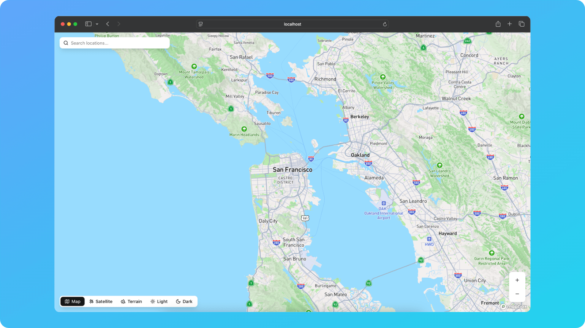
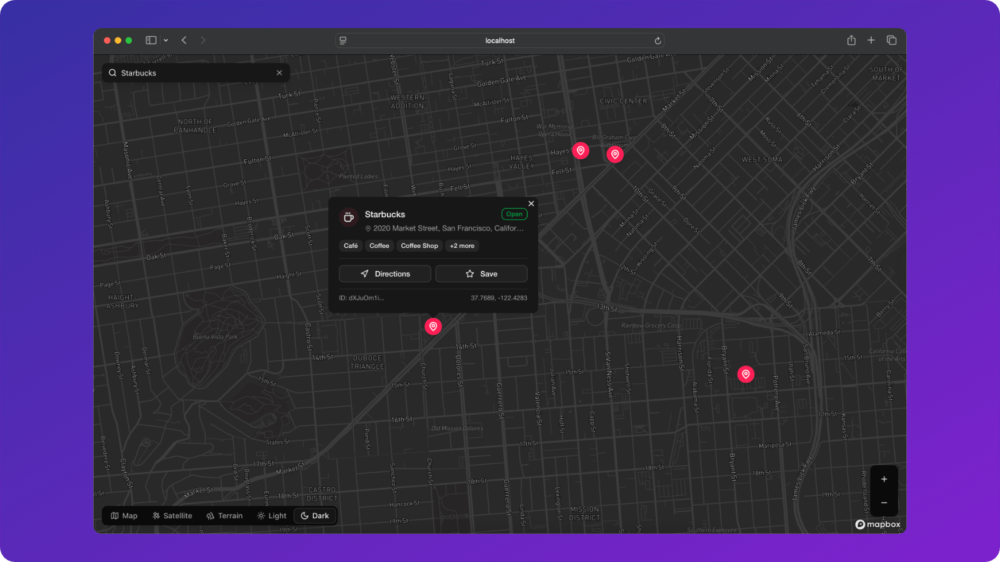
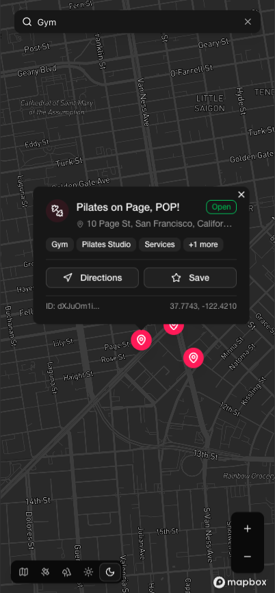

# 🗺️ Modern Map in Next.js with Mapbox

#### Lightweight, clean and beautifully-designed map with Next.js, Mapbox, shadcn ui, and Tailwind. Customizable and extensible component design.

https://github.com/user-attachments/assets/9caa968c-bfe1-44bf-a1dc-b375070a3e93

<div align="center">
  
  <br><br>
  
  <br><br>
  
  <br><br>
  
</div>

## ⚡ Stack

- Next.js (App Router)
- Tailwind CSS
- shadcn/ui
- Mapbox GL JS
- Mapbox Searchbox API

## 🔍 Features

- 📍 Mapbox GL interactive map
- 🔎 Mapbox Searchbox API
- 🎨 Clean UI with shadcn/ui
- ⚡ Responsive & fast
- 📱 Mobile-friendly layout

## 🚀 Getting Started

First, install dependencies and start the development server:

```sh
git clone https://github.com/AnmolSaini16/next-maps.git
cd your-repo
npm install
npm run dev
```

### 🔐 Environment Variables

```sh
NEXT_PUBLIC_MAPBOX_TOKEN=your_mapbox_access_token
NEXT_PUBLIC_MAPBOX_SESSION_TOKEN=your_uuidv4_session_token
```

## 📦 Deployment

Deploy on [Vercel](https://vercel.com) in seconds.

## 📚 Docs

- [Next.js Docs](https://nextjs.org/docs)
- [Mapbox GL JS](https://docs.mapbox.com/mapbox-gl-js/guides)
- [Tailwind CSS](https://tailwindcss.com/docs)
- [shadcn/ui Docs](https://ui.shadcn.com/docs)

## 🤝 Contributing

Contributions are welcome!
If you’d like to improve this project, feel free to fork it and open a pull request.

## ☕ Support Me

If you find this project useful, consider supporting me:

[Sponsor on github](https://github.com/sponsors/AnmolSaini16)

<a href="https://www.buymeacoffee.com/anmoldeep_singh" target="_blank"></a>
